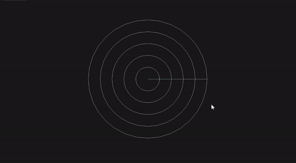
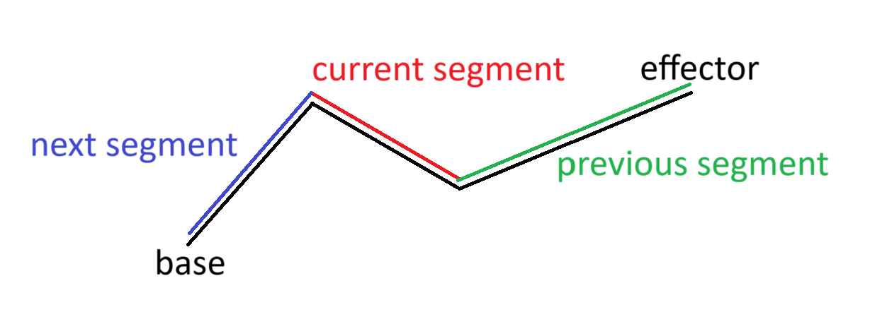
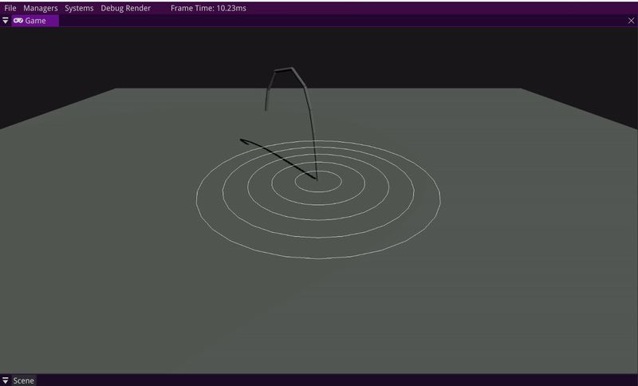
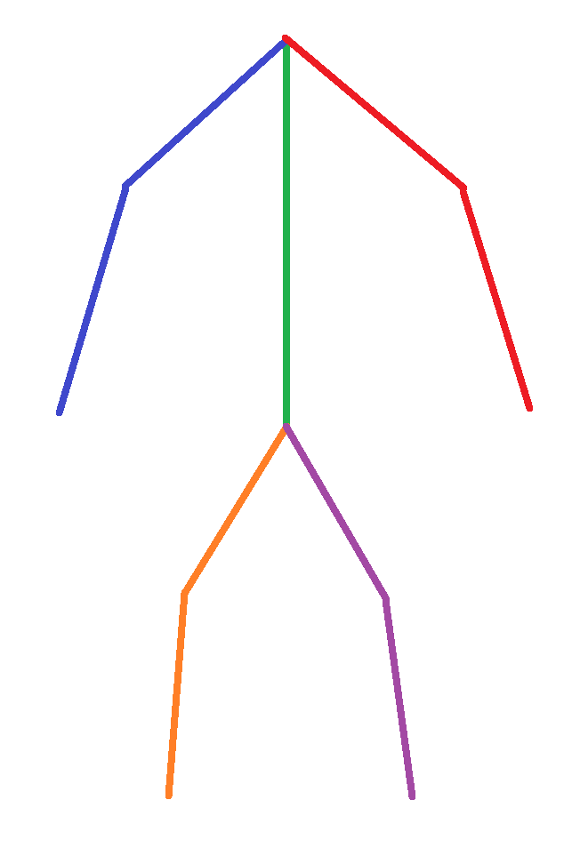
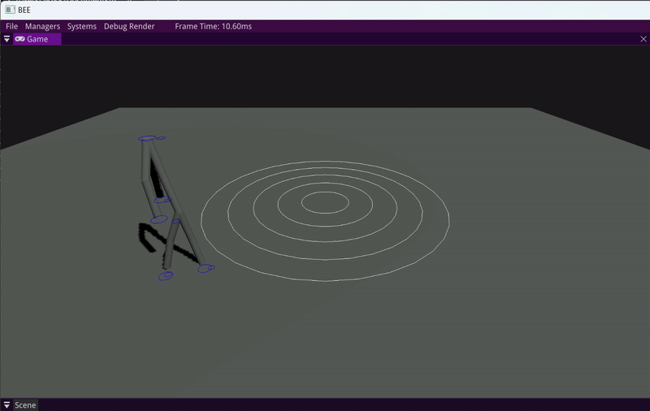

### Introduction

In this post about Inverse Kinematics I will demonstrate how I've made my Inverse Kinematics. An important heads up is that I am using an ECS and the algorithm I used for my Inverse Kinematics is the FABRIK algorithm.

<div style="text-align: center;">
  <a href="#forward-kinematics">forward kinematics</a> 
<br>
  <a href="#inverse-kinematics">inverse kinematics</a>  
<br>
  <a href="#loading-rigs-from-blender">loading rigs</a>  
<br>
  <a href="#usability-of-library">usability</a>
</div>

### Forward kinematics

Before we get into the actual Inverse Kinematics we will first take a look at some 2D forward kinematcs. The algorithm for forward kinematics is quite simple. All I do is give one segment an angle to rotate with and all following segments will rotate with the same angle. After this we move every segment to the end of the previous segment. In code That looks something like this:

``` cpp

    for (int j = i; j < (int)arm.segment.size(); j++)
    {
        auto t1_curr = &Engine.ECS().Registry.get<Transform>(arm.segment[j]);
        auto t1_prev = Transform();
        auto s1_prev = Segment();

        if (j != 0)
        {
            t1_prev = Engine.ECS().Registry.get<Transform>(arm.segment[j - 1]);
            s1_prev = Engine.ECS().Registry.get<Segment>(arm.segment[j - 1]);
            t1_curr->SetTranslation(t1_prev.GetTranslation() + t1_prev.GetRotation() * forward * s1_prev.length);
        }

        t1_curr->SetRotation(s->angle * t1_curr->GetRotation());
    }

```

Before I do that, I also do a check to see if the angle is greater than the maximum angle the segment can go. To do this, I get the current angle between two quaternions. If the angle has passed the maximum, I check if the new angle angle is smaller than both the maximum angle and the old rotation, otherwise I clamp the new rotation to the maximum angle. This is to make sure that the arm does not get stuck past the max angle because it isn't allowed to move anymore. Below you can see what that looks like in code:

``` cpp

float dot_product = glm::dot(glm::normalize(t->GetRotation()), glm::normalize(t_prev->GetRotation()));
float old_angle = glm::acos(dot_product);

if (old_angle > s->max_angle)
{
    Transform test_t = *Engine.ECS().Registry.try_get<Transform>(arm.segment[i]);
    test_t.SetRotation(s->angle * test_t.GetRotation());
    dot_product = glm::dot(glm::normalize(test_t.GetRotation()), glm::normalize(t_prev->GetRotation()));
    float new_angle = glm::acos(dot_product);
    if (new_angle > old_angle) s->angle = {1, 0, 0, 0};
}

```

And a GIF  of forward kinematics in action:



### Inverse Kinematics



<small>Note: this is which segment I mean with next or previous in the code. This is both in the forward and backwards reaching parts to avoid confusion while working on the algorithm.</small>

For the FABRIK algorithm, there are two main parts; the forward reaching and backwards reaching part. In the forward reaching part I set each segments position equal to the previous segments end position, and I point the segment to the base of the next segment.

For the segment at the end of the arm, I set it's position equal to the effector instead.

And for the segment connected to the base, I point it to the base instead.

All this can be seen below. Note that this is a very simplified version of the actual code.

``` cpp
    for (int i = (int)arm.segment.size() - 1; i >= 0; i--)
    {
        if (i == (int)arm.segment.size() - 1)
        {
            t->SetTranslation(arm.effector);
            glm::vec3 dir = -glm::normalize(arm.effector - t_next.GetTranslation()) * s->length;
            t->SetRotation(DirectionToQuaternion(dir));
        }
        else if (i == 0)
        {
            t->SetTranslation(t_prev.GetTranslation() + t_prev.GetRotation() * forward * s_prev.length);
            glm::vec3 dir = -glm::normalize(t->GetTranslation() - arm.base) * s->length;
            t->SetRotation(DirectionToQuaternion(dir));
        }
        else
        {
            t->SetTranslation(t_prev.GetTranslation() + t_prev.GetRotation() * forward * s_prev.length);
            glm::vec3 dir = -glm::normalize(t->GetTranslation() - t_next.GetTranslation()) * s->length;
            t->SetRotation(DirectionToQuaternion(dir));
        }
    }
```

For the backwards part, I set the segment equal to end point of the next segment and point it to the base of the previous segment. Pretty similar to the previous loop, but an important difference here is that this loop increments i after each iteration, instead of decrementing, like in the previous loop.

In this loop the segment at the end of the arm it points to the effector instead of the base of the previous segment.

The position of the segment at the base of the arm is set equal to the base of the arm instead of the end point of the next segment.

The code for the backwards part can be seen below.

``` cpp
    for (int i = 0; i < (int)arm.segment.size(); i++)
    {
        if (i == (int)arm.segment.size() - 1)
        {
            t->SetTranslation(t_next.GetTranslation() + t_next.GetRotation() * forward * s_next.length);
            glm::vec3 dir = glm::normalize(-glm::normalize(t->GetTranslation() - arm.effector));
            t->SetRotation(DirectionToQuaternion(dir));
        }
        else if (i == 0)
        {
            t->SetTranslation(arm.base);
            glm::vec3 dir = glm::normalize(-glm::normalize(arm.base - t_prev.GetTranslation()));
            t->SetRotation(DirectionToQuaternion(dir));
        }
        else
        {
            t->SetTranslation(t_next.GetTranslation() + t_next.GetRotation() * forward * s_next.length);
            glm::vec3 dir = glm::normalize(-glm::normalize(t->GetTranslation() - t_prev.GetTranslation()));
            t->SetRotation(DirectionToQuaternion(dir));
        }
    }
```

To add a segment to an arm I have made a function to add a segment to it's respective arm. This function can be seen below. This is to make the library a lot more usable.

```cpp
void ArmInverse::AddSegment(float length, float width, float max_angle, glm::vec3 preferred_direction, std::string file_path)
{
    auto segment_entity = Engine.ECS().CreateEntity();
    auto& seg = Engine.ECS().CreateComponent<Segment>(segment_entity);
    seg.length = length;
    seg.max_angle = max_angle;
    seg.preferred_direction = preferred_direction;
    auto& trans = Engine.ECS().CreateComponent<bee::Transform>(segment_entity);
    trans.SetScale({width, width, length / 2.0f});
    segment.push_back(segment_entity);

    if (file_path.size() > 1)
    {
        auto& mesh_renderer = Engine.ECS().CreateComponent<bee::MeshRenderer>(segment_entity);
        auto box_model = Engine.Resources().Load<bee::Model>(bee::FileIO::Directory::SharedAssets, file_path);
        mesh_renderer.Material = box_model->GetMaterials()[0];
        mesh_renderer.Mesh = box_model->GetMeshes()[1];
        seg.has_model = true;
    }
}
```

This is what all that together can make;



### Loading rigs from Blender

For the loading of the rigs from blender, I first read the file, and store all the bones in a vector with all the data I will need.

I will assert if `bones` is empty, because this means the file that has been passed is invalid.

The `pop_back()` at the end is because before going into the skins section there is an armature section, wich it will also store. We can just simply remove the last element to fix this, because every file has this.

This can be seen below;

```cpp
Rig::Rig(std::string file_path)
{
    std::string data = Engine.FileIO().ReadTextFile(FileIO::Directory::SharedAssets, file_path);

    std::istringstream stream(data);
    std::string line;

    bool inNodesSection = false;
    glm::vec3 currentTranslation;
    int id_count = 0;

    while (std::getline(stream, line))
    {
        if (line.find("\"nodes\"") != std::string::npos)
        {
            inNodesSection = true;
        }
        else if (inNodesSection)
        {
            if (line.find("skins") != std::string::npos)
            {
                inNodesSection = false;
            }
            if (line.find("{") != std::string::npos)
            {
                bones.push_back({id_count});
                id_count++;
            }
            if (line.find("\"name\":\"Bone") != std::string::npos)
            {
                std::string name = removeNonNumbers(line);
                if(!name.empty()) bones.back().name = std::stoi(name);
            }
            if (line.find("children") != std::string::npos)
            {
                std::string value;
                std::vector<int> values;

                while (std::getline(stream, value))
                {
                    value.erase(std::remove_if(value.begin(), value.end(), ::isspace), value.end());

                    if (value.find("]") == std::string::npos)
                    {
                        values.push_back(std::stoi(value));
                    }
                    else
                    {
                        bones.back().child = values;
                        break;
                    }
                }
            }
            if (line.find("\"translation\"") != std::string::npos)
            {
                std::string value;
                std::vector<float> values;

                while (std::getline(stream, value))
                {
                    value.erase(std::remove_if(value.begin(), value.end(), ::isspace), value.end());

                    if (!value.empty())
                    {
                        values.push_back(std::stof(value));
                    }

                    if (values.size() == 3)
                    {
                        currentTranslation = glm::vec3(values[0], values[1], values[2]);
                        bones.back().translation = currentTranslation;
                        break;
                    }
                }
            }
        }
    }
    assert(!bones.empty() && "invalid file");
    bones.pop_back();
```



Next I determine what the parent should be for every bone. In the same loop, I also create new arms if the arm splits up into 2 or more other arms. For this, I need to make a new arm entity, which can be seen above. Every arm that splits off into multiple arms is it's own arm, that in turn can have as many segments as needed. In the image above every color represents it's own arm, and in the code below I generate an arm eveytime there is a split.

```cpp
    int arm_count = 0;
    for (int i = 0; i < bones.size(); i++)
    {
        if (bones[i].child.size() > 1)
        {
            for (int j = 0; j < bones[i].child.size(); j++)
            {
                bones[bones[i].child[j]].isNewArm = true;
                bones[bones[i].child[j]].is_added = true;
                arm_entity.push_back(entt::null);
                arm_entity[arm_count] = Engine.ECS().CreateEntity();
                auto& arm_comp = Engine.ECS().CreateComponent<ArmInverse>(arm_entity[arm_count]);
                arm_comp.AddSegment(1.0f, 0.1f, 1.0f, {0, 0, 0}, "models/BoxAndCylinder.gltf");
                bones[bones[i].child[j]].arm_entity = arm_entity[arm_count];
                arm_count++;
            }
        }
        for (int j = 0; j < bones[i].child.size(); j++)
        {
            int bone_id = bones[i].child[j];
            bones[bone_id].parent = i;
        }
    }
```

To make sure we have all the arms, we also need to make sure we have the starting points of an arm, not were there is a split, but if a bone does not have a parent, that is where we also need to add an arm entity. It is possible we handle a child of such a segment before the arm is created. in this case, we need to go to said segment(the parent of the segment we're currently handling), create the arm, and then add the segment for it, after that we can add the segment we initially wanted to add.

After this loop we have created all the segments we wanted to add.

The code can be seen below;

```cpp
    for (int i = 0; i < bones.size(); i++)
    {
        if (!bones[i].is_added)
        {
            if (bones[i].parent == -1)
            {
                bones[i].isNewArm = true;
                bones[i].is_added = true;
                arm_entity.push_back(entt::null);
                arm_entity[arm_count] = Engine.ECS().CreateEntity();
                auto& arm_comp = Engine.ECS().CreateComponent<ArmInverse>(arm_entity[arm_count]);
                arm_comp.AddSegment(1.0f, 0.1f, 1.0f, {0, 0, 0}, "models/BoxAndCylinder.gltf");
                bones[i].arm_entity = arm_entity[arm_count];
                arm_count++;
            }
            else
            {
                bones[i].is_added = true;
                if (bones[bones[i].parent].arm_entity == entt::null)
                {
                    int parent_id = bones[i].parent;
                    bones[parent_id].is_added = true;
                    arm_entity.push_back(entt::null);
                    arm_entity[arm_count] = Engine.ECS().CreateEntity();
                    auto& arm_comp = Engine.ECS().CreateComponent<ArmInverse>(arm_entity[arm_count]);
                    arm_comp.AddSegment(1.0f, 0.1f, 1.0f, {0, 0, 0}, "models/BoxAndCylinder.gltf");
                    bones[parent_id].arm_entity = arm_entity[arm_count];
                    arm_count++;
                }
                bones[i].arm_entity = bones[bones[i].parent].arm_entity;
                auto& arm_comp = Engine.ECS().Registry.get<ArmInverse>(bones[i].arm_entity);
                arm_comp.AddSegment(1.0f, 0.1f, 1.0f, {0, 0, 0}, "models/BoxAndCylinder.gltf");
            }
        }
    }
}
```

To make sure all the seperate arms stick together there is a rig manager system that updates all the rigs to stick all the arms together at the correct position.

code for this can be seen below;

```cpp
void RigManager::Update(float) { 
    for (const auto& [entity, rig] : Engine.ECS().Registry.view<Rig>().each())
    {
        for (int i = 0; i < rig.bones.size(); i++)
        {
            if (rig.bones[i].child.size() > 1)
            {
                for (int j = 0; j < rig.bones[i].child.size(); j++)
                {
                    auto& arm_comp = Engine.ECS().Registry.get<ArmInverse>(rig.bones[i].arm_entity);
                    auto& arm_comp1 = Engine.ECS().Registry.get<ArmInverse>(rig.bones[rig.bones[i].child[j]].arm_entity);

                    auto trans = Engine.ECS().Registry.get<Transform>(arm_comp.segment[arm_comp.segment.size() - 2]);
                    auto seg = Engine.ECS().Registry.get<Segment>(arm_comp.segment[arm_comp.segment.size() - 2]);
                    glm::vec3 forward = glm::vec3(0, 0, 1);
                    glm::vec3 pos = trans.GetTranslation() + glm::normalize(trans.GetRotation() * forward) * seg.length * 0.5f;

                    arm_comp1.base = pos;
                }
            }
            if (rig.bones[i].parent == -1)
            {
                Engine.ECS().Registry.get<ArmInverse>(rig.bones[i].arm_entity).base = rig.base;
            }
        }
    }
}
```

### Usability of Library

Rigs can be loaded from blender quite easily by making an entity and adding a rig component with a file path as argument like this:

```cpp
rig = Engine.ECS().CreateEntity();
Engine.ECS().CreateComponent<Rig>(rig, "models/test.gltf");
```

The model will now bee in bee with a base and control points that can be adjusted in game code.

Below can be seen what that could look like;




If you don't want/need to load a complete rig, but just one arm, that is also possible. This can be done by making an entity and adding the arm component to it. To add more segments, you can call a function on the component. Below you can see what this looks like in code;

```cpp
auto arm = bee::Engine.ECS().CreateEntity();
auto& arm_comp = Engine.ECS().CreateComponent<ArmInverse>(arm);

arm_comp.AddSegment(1.0f, 0.07f, glm::pi<float>(), {0, 0, 1.0f}, "models/BoxAndCylinder.gltf");
```

<div style="text-align: center;">
  <a href="#top">go back to top</a>
</div>